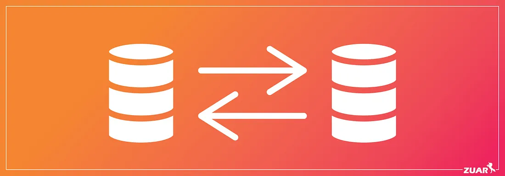

# Migration of Recommendation Table


## Overview

We have **one billion** existing records in our `recommendation` table that must be migrated from an old PostgreSQL database to a new PostgreSQL database. Additionally, we receive **200 million** new records daily, and we need a strategy to migrate this incremental data without causing downtime or data loss.

### Table: `recommendation`

| Column Name           | Description                                                         |
|-----------------------|---------------------------------------------------------------------|
| `id`                  | Primary key for the recommendation                                  |
| `customer_id`         | Foreign key to the customer table                                  |
| `products_id`         | Foreign key to the product table                                   |
| `recommendation_date` | Timestamp                                                          |
| `last_modified_date`  | Timestamp                                                          |

> **Note:** We want the most recent data (e.g., last few loads) to remain available in the old database until the new system is fully validated.

## Migration Strategy

Our approach follows these key steps:

* **Dual Writes**: From the moment you begin the migration, write new data to both the old and new `recommendation` tables.
* **Bulk Migrate Existing Data**: Use timestamp-based chunking and multiple workers to gradually move the 1B existing rows to the new DB, verifying as you go.
* **Shadow Read and Validate**: Compare reads from both databases. Once confident, switch all reads to the new table in stages.
* **Stop Writing to Old**: After the new table is fully validated under real load, write exclusively to the new DB.
* **Clean Up**: Once you're sure no system depends on the old table, archive or drop it.

## Implementation

### 1. Dual Write Implementation

First, we implemented a service that writes to both databases simultaneously:

```python
class RecommendationService:
    def __init__(self, old_db_service, new_db_service):
        self.old_db_service = old_db_service
        self.new_db_service = new_db_service

    def create_recommendation(self, customer_id, product_id, recommendation_date, last_modified_date=None):
        # Default last modified date to now if not provided
        if last_modified_date is None:
            last_modified_date = datetime.now()

        # Write to old database
        old_id = self.old_db_service.insert_recommendation(
            customer_id, product_id, recommendation_date, last_modified_date
        )

        # Write to new database
        new_id = self.new_db_service.insert_recommendation(
            customer_id, product_id, recommendation_date, last_modified_date
        )

        return old_id
```

### 2. Historical Data Migration

For the 1 billion existing records, we use timestamp-based chunking with multiple workers:

```python
from multiprocessing import Process
from datetime import datetime, timedelta
import time

def migrate_historical_data(start_date=None, end_date=None, batch_size=10000, workers=8):
    """
    Migrate historical data in batches using multiple workers

    Args:
        start_date: Optional timestamp to start migration from
        end_date: Optional timestamp to end migration at
        batch_size: Number of records to process in each batch
        workers: Number of parallel workers
    """
    # If no dates specified, get the timestamp range
    if not start_date:
        start_date = get_earliest_timestamp()
    if not end_date:
        end_date = get_latest_timestamp()

    # Divide the timestamp range into chunks for parallel processing
    time_chunks = divide_time_range(start_date, end_date, workers)

    # Create and start worker processes
    processes = []
    for i in range(workers):
        chunk_start, chunk_end = time_chunks[i]
        p = Process(target=migrate_chunk,
                   args=(chunk_start, chunk_end, batch_size))
        p.start()
        processes.append(p)

    # Wait for all processes to complete
    for p in processes:
        p.join()
```

The worker function that does the actual migration:

```python
def migrate_chunk(start_time, end_time, batch_size):
    """Migrate a specific chunk of time-based data"""

    current_time = start_time

    while current_time < end_time:
        next_time = min(current_time + timedelta(hours=1), end_time)

        # Get batch of records from old database
        query = f"""
            SELECT id, customer_id, products_id, recommendation_date, last_modified_date
            FROM recommendation
            WHERE recommendation_date >= %s AND recommendation_date < %s
            ORDER BY recommendation_date
            LIMIT {batch_size}
        """

        records = old_db.execute(query, (current_time, next_time))

        if not records:
            current_time = next_time
            continue

        # Insert records into new database
        for batch in chunk_records(records, 1000):
            insert_batch_to_new_db(batch)

            # Add controlled delay to avoid overloading
            time.sleep(0.01)

        # Update current time marker based on last processed record
        current_time = records[-1].recommendation_date

        # Log progress
        print(f"Migrated records up to {current_time}")
```

Helper functions for dividing time ranges and chunking records:

```python
def divide_time_range(start_date, end_date, chunks):
    """Divide a time range into equal chunks"""
    total_seconds = (end_date - start_date).total_seconds()
    chunk_seconds = total_seconds / chunks

    time_chunks = []
    for i in range(chunks):
        chunk_start = start_date + timedelta(seconds=i * chunk_seconds)
        chunk_end = start_date + timedelta(seconds=(i + 1) * chunk_seconds)
        if i == chunks - 1:
            chunk_end = end_date  # Make sure the last chunk ends exactly at end_date
        time_chunks.append((chunk_start, chunk_end))

    return time_chunks

def chunk_records(records, chunk_size):
    """Split records into smaller chunks for batch processing"""
    for i in range(0, len(records), chunk_size):
        yield records[i:i + chunk_size]
```

### 3. Data Verification

To ensure data consistency, we implemented verification processes:

```python
def verify_migration(sample_size=10000):
    """Verify that a random sample of records was migrated correctly"""

    # Get random sample of IDs from old database
    query = """
        SELECT id FROM recommendation
        ORDER BY RANDOM()
        LIMIT %s
    """
    sample_ids = [row[0] for row in old_db.execute(query, (sample_size,))]

    # Check each record
    mismatches = 0
    for old_id in sample_ids:
        old_record = get_record_from_old_db(old_id)
        new_record = get_record_from_new_db(old_id)

        if not records_match(old_record, new_record):
            print(f"Mismatch found for ID {old_id}")
            mismatches += 1

    if mismatches == 0:
        print(f"All {sample_size} records verified successfully")
        return True
    else:
        print(f"Found {mismatches} mismatches out of {sample_size} records")
        return False

def records_match(record1, record2):
    """Compare two records for equality"""
    # Compare all fields except possibly auto-incremented fields
    return (record1.customer_id == record2.customer_id and
            record1.products_id == record2.products_id and
            record1.recommendation_date == record2.recommendation_date and
            record1.last_modified_date == record2.last_modified_date)
```

### 4. Shadow Testing and Switching Read Operations

We implemented shadow testing to compare results from both databases:

```python
def shadow_test(test_queries, sample_size=100):
    """
    Run test queries against both databases and compare results

    Args:
        test_queries: List of query templates to test
        sample_size: Number of queries to run for each template
    """
    results = {"success": 0, "mismatch": 0, "error": 0}

    for query_template in test_queries:
        for _ in range(sample_size):
            # Generate parameters for the query (e.g., random customer_id)
            params = generate_random_params(query_template)

            try:
                # Execute on old DB
                old_result = old_db.execute(query_template, params)

                # Execute on new DB
                new_result = new_db.execute(query_template, params)

                # Compare results
                if results_match(old_result, new_result):
                    results["success"] += 1
                else:
                    results["mismatch"] += 1
                    print(f"Mismatch for query: {query_template} with params {params}")
            except Exception as e:
                results["error"] += 1
                print(f"Error executing query: {query_template} with params {params}")
                print(f"Error: {str(e)}")

    print(f"Shadow test results: {results}")
    success_rate = results["success"] / (results["success"] + results["mismatch"] + results["error"])
    print(f"Success rate: {success_rate:.2%}")

    return success_rate > 0.99  # Consider successful if 99% or more queries match
```

After validation, we implement a configurable reader:

```python
class RecommendationReader:
    def __init__(self):
        self.use_new_db = get_migration_config('use_new_db_for_reads')

    def get_recommendations_for_customer(self, customer_id, limit=10):
        """Get recommendations for a specific customer"""
        if self.use_new_db:
            return new_db.get_recommendations(customer_id, limit)
        else:
            return old_db.get_recommendations(customer_id, limit)
```

### 5. Switching Write Operations

When we're confident everything is working well:

```python
class RecommendationService:
    def __init__(self, old_db_service, new_db_service):
        self.old_db_service = old_db_service
        self.new_db_service = new_db_service
        self.write_to_old_db = get_migration_config('write_to_old_db')

    def create_recommendation(self, customer_id, product_id, recommendation_date, last_modified_date=None):
        if last_modified_date is None:
            last_modified_date = datetime.now()

        # Write to old database if flag is still on
        old_id = None
        if self.write_to_old_db:
            old_id = self.old_db_service.insert_recommendation(
                customer_id, product_id, recommendation_date, last_modified_date
            )

        # Always write to new database
        new_id = self.new_db_service.insert_recommendation(
            customer_id, product_id, recommendation_date, last_modified_date
        )

        return new_id if old_id is None else old_id
```

### 6. Recent Data Retention

For the requirement to keep recent data available in the old system:

```python
def retain_recent_data(days_to_retain=7):
    """Make sure recent data is always in the old system"""

    retention_date = datetime.now() - timedelta(days=days_to_retain)

    # Get records from new DB that should be in old DB
    query = """
        SELECT id, customer_id, products_id, recommendation_date, last_modified_date
        FROM new_db.recommendation
        WHERE recommendation_date >= %s
        AND id NOT IN (SELECT id FROM old_db.recommendation WHERE recommendation_date >= %s)
    """

    missing_records = new_db.execute(query, (retention_date, retention_date))

    # Insert missing records to old DB
    for batch in chunk_records(missing_records, 1000):
        insert_batch_to_old_db(batch)
```

## Tools and Technologies

1. **PostgreSQL Native Tools**: We leverage `psycopg2` for Python connectivity to PostgreSQL
2. **Multiprocessing**: For parallel data migration to speed up the process
3. **Configuration Management**: Dynamic flags for controlling read/write behavior
4. **Monitoring and Logging**: Integrated with our monitoring system to track progress and errors

## Challenges and Solutions

1. **High Data Volume**:
   - Solution: Timestamp-based chunking and parallel processing

2. **Zero Downtime Requirement**:
   - Solution: Dual-write pattern and gradual read switchover

3. **Data Consistency**:
   - Solution: Comprehensive verification and shadow testing

4. **Resource Constraints**:
   - Solution: Controlled delays and batch processing to manage resource usage

## Rollback Strategy

If issues are discovered during validation:

1. Keep the dual-write system active
2. Switch reads back to the old database
3. Fix any data inconsistencies in the new database
4. Retry validation

## Conclusion

This migration strategy ensures zero downtime and prevents data loss while maintaining recent data availability in the old system until the migration is fully validated. The implementation details shown here provide a complete blueprint for handling large-scale PostgreSQL migrations.

## References

1. [Stripe Blog: Online Migrations](https://stripe.com/blog/online-migrations)
